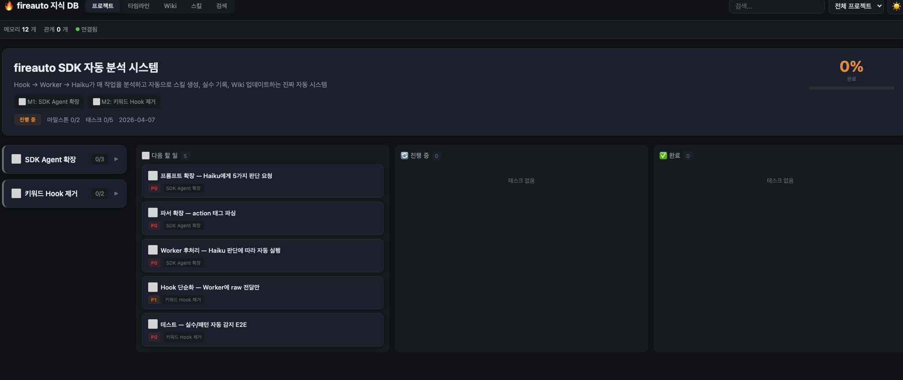
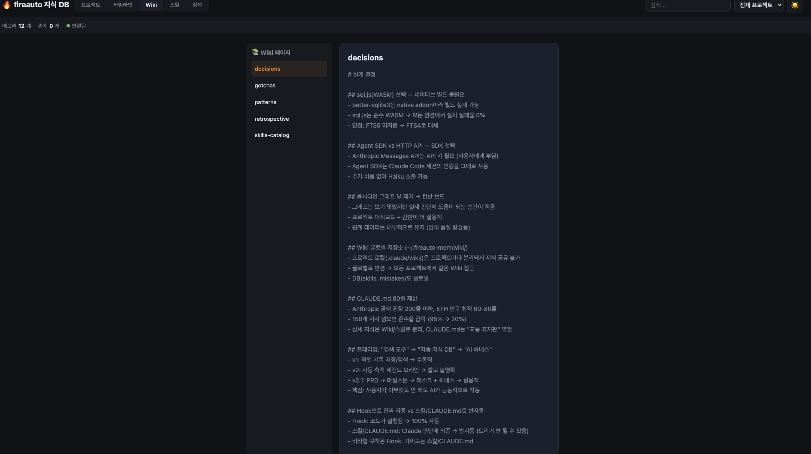
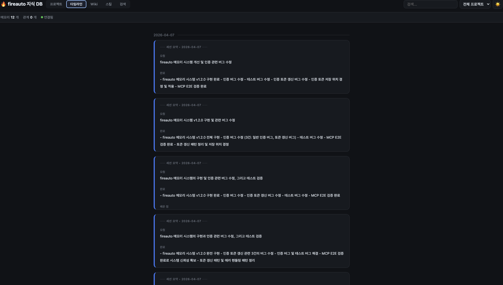
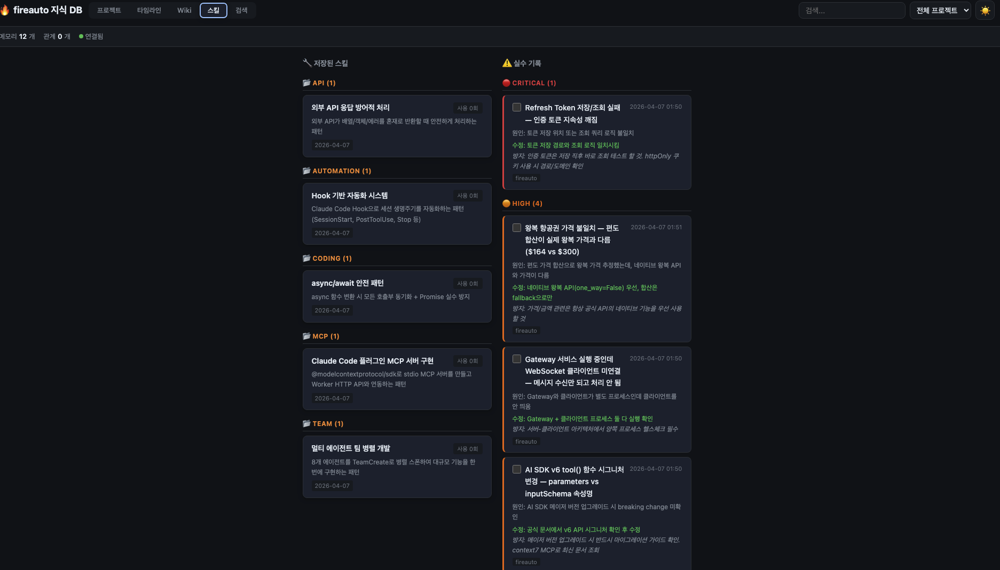

<p align="center">
  
</p>

<h1 align="center">fireauto</h1>

<p align="center">
  설치 한 번이면 AI가 알아서 해요.<br/>
  PRD 작성, 마일스톤 관리, 지식 축적, 실수 학습, 세션 복기까지.<br/>
  당신은 코딩만 하세요. 나머지는 fireauto가 할게요.
</p>

<p align="center">
  <a href="#이게-뭔가요">소개</a> · <a href="#시작하기">시작하기</a> · <a href="#대시보드">대시보드</a> · <a href="#핵심-기능">핵심 기능</a> · <a href="#전체-커맨드">전체 커맨드</a> · <a href="#각-기능-상세">상세 설명</a> · <a href="#자주-묻는-질문">FAQ</a>
</p>

<p align="center">
  <a href="https://github.com/imgompanda/fireauto/stargazers"></a>
  <a href="https://github.com/imgompanda/fireauto/releases/latest"></a>
  <a href="https://github.com/imgompanda/fireauto/blob/main/LICENSE"></a>
</p>

<p align="center">
  도움이 됐다면 Star를 눌러주세요. 업데이트 소식을 받아볼 수 있어요.
</p>

---

## 이게 뭔가요?

fireauto는 Claude Code를 위한 **AI 개발 하네스**예요.

하네스가 뭐냐면, 말에게 씌우는 마구(고삐)처럼 **AI에게 방향을 잡아주는 시스템**이에요. 설치만 하면 AI가 알아서:

- 프로젝트를 체계적으로 관리해요 (PRD -> 마일스톤 -> 태스크)
- 작업 기록을 자동으로 축적해요 (지식 DB)
- 실수에서 배워요 (자동 규칙 업데이트)
- 세션마다 복기해요 (실수는 크게, 성공은 조용히)
- 다음 세션에 "오늘 할 일"을 알려줘요
- 반복 패턴을 감지해서 스킬로 자동 생성해요

Andrej Karpathy의 **LLM Knowledge Base** 패턴과 Claude Code 팀의 **하네스 관리 원칙**에 따라 설계됐어요.

---

## 어떻게 동작하나요?

### 설치 후 자동으로 일어나는 일

| 시점 | 자동 동작 | 기술 |
|------|----------|------|
| 세션 시작 | 프로젝트 상태 + 주의사항 알려줌 | SessionStart Hook |
| 코드 수정 | 작업 기록 자동 축적 + AI 요약 | PostToolUse Hook + Haiku |
| 실수 시 | Haiku가 자동으로 실수 감지 + CLAUDE.md 규칙 추가 | PostToolUse Hook + Agent SDK |
| 코드 수정 후 | 자동 린트 (성공은 조용히, 에러만 시끄럽게) | PostToolUse Hook |
| 패턴 반복 | 3회 이상 반복되면 스킬 자동 생성 | PostToolUse Hook |
| CLAUDE.md 비대 | 80줄 초과 시 자동으로 Wiki로 이동 | PostToolUse Hook |
| 세션 종료 | 자동 복기 (실수 크게, 성공 조용히) + 세션 요약 저장 | Stop Hook |

**사용자가 할 일: 없음.** 그냥 코딩하면 돼요.

---

## 시작하기

### 1단계: fireauto 설치

```bash
# Claude Code 안에서 실행
/plugin marketplace add imgompanda/fireauto
/plugin install fireauto@fireauto
```

설치 끝. 이제 커맨드를 바로 쓸 수 있어요.

> GitHub에서 안 되면: `git clone https://github.com/imgompanda/fireauto.git` -> `/plugin marketplace add ./fireauto` -> `/plugin install fireauto@fireauto`

### 2단계: 원클릭 세팅

```bash
/freainer
```

이것만 실행하면 전부 알아서 해줘요:

| 항목 | 설명 |
|------|------|
| **Context7 MCP** | 라이브러리 최신 문서를 AI가 실시간 참조 |
| **Playwright MCP** | 브라우저 자동화 + E2E 테스트 |
| **Draw.io MCP** | 아키텍처도, 플로우차트, ERD 자동 생성 |
| **LSP 설정** | 코드 탐색 속도와 정확도 극대화 |
| **알림 훅** | 작업 완료 시 macOS 알림 |
| **에이전트 팀** | 여러 AI가 동시 작업 |
| **스킬 자동 트리거** | 상황에 맞게 스킬 자동 활성화 |
| **메모리 시스템** | 개발 지식 자동 축적 + AI 분석 |
| **프로젝트 세팅** (선택) | PRD, CLAUDE.md, Wiki, 마일스톤 자동 생성 |

전부 무료, API 키 불필요.

### 3단계: 보일러플레이트 (선택)

새 프로젝트를 시작하려면 **[FireShip Starter Kit](https://github.com/imgompanda/FireShipZip3)**을 추천해요.

```bash
/fireship-install
```

인증, 결제(Paddle/Toss), AI, 이메일, 다국어가 다 들어있어요.

[데모 보기](https://fire-ship-zip3.vercel.app) · [보일러플레이트 자세히 보기](https://github.com/imgompanda/FireShipZip3)

---

## 대시보드

`http://localhost:37888` 에서 모든 걸 볼 수 있어요.

메모리 시스템이 설치되면 Worker 서버가 자동으로 시작되고, 대시보드가 바로 열려요.

| 탭 | 내용 |
|---|------|
| **프로젝트** | 마일스톤 진행률 + 칸반 보드 (다음 할 일 / 진행 중 / 완료) |
| **타임라인** | AI가 자동 요약한 지식 카드 (세션별 그룹핑) |
| **Wiki** | 패턴, 주의사항, 결정 사항 페이지 |
| **스킬** | 자동 생성된 스킬 + 실수 기록 |
| **검색** | 축적된 지식 전문 검색 (FTS4 한국어 지원) |
| **설정** | Haiku/Sonnet/Opus 모델 선택 |

대시보드에서 프로젝트 진행률을 한눈에 확인하고, 마일스톤을 클릭하면 태스크가 펼쳐져요.

---

## 핵심 기능

### 프로젝트 관리 -- 코딩 전에 계획부터

```bash
/freainer   # 프로젝트 시작 시 PRD 자동 생성
/project    # 프로젝트 대시보드
/next       # 다음 태스크 시작 (AI가 관련 지식도 알려줌)
```

PRD를 작성하면 AI가 자동으로:
- 마일스톤으로 나누고
- 태스크로 분해하고 (1-4시간 단위로 쪼개요)
- 칸반 보드에 배치해요

태스크는 `pending -> in_progress -> completed` 순서로 진행돼요. `/next`를 실행하면 AI가 다음 할 일을 찾아서, 관련 지식까지 함께 알려줘요. "시작할게"라고 하면 바로 코딩을 시작해요.

대시보드: `http://localhost:37888` (프로젝트 탭)

<p align="center">
  
</p>

### 지식 축적 -- 코딩하면 자동으로 쌓여요

코드를 수정할 때마다 AI(Haiku)가 자동으로:
- "이건 버그 수정이고, 원인은 이거다" 분석
- "이건 반복할 패턴이다" 축적
- "이건 주의사항이다" 태깅
- 지식끼리 자동 관계 연결 (같은 파일, 같은 태그, 시간적 연속)

`~/.fireauto-mem/wiki/`에 프로젝트 지식이 자동으로 정리돼요:

| 파일 | 내용 |
|------|------|
| `patterns.md` | 코딩 패턴, 모범 사례 |
| `gotchas.md` | 삽질 기록, 주의사항 |
| `decisions.md` | 설계 결정 + 이유 |
| `skills-catalog.md` | 자동 생성된 스킬 목록 |
| `retrospective.md` | 세션별 복기 |
| `index.md` | 자동 생성 목록 |

<p align="center">
  
</p>

**사용자가 할 일: 없음.** 코딩만 하면 지식이 알아서 쌓여요.

대시보드: `http://localhost:37888` (타임라인 탭)

<p align="center">
  
</p>

### 자기 학습 -- AI가 실수에서 배워요

AI가 실수하면:
1. Haiku가 자동으로 실수를 감지해서 DB에 기록 (PostToolUse Hook + Agent SDK)
2. `gotchas.md`에 주의사항 추가
3. CLAUDE.md에 방지 규칙 추가
4. 다음에 같은 실수 안 함

같은 작업이 3회 이상 반복되면:
1. 반복 패턴을 자동 감지 (PostToolUse Hook이 3회마다 체크)
2. 스킬로 자동 생성
3. `skills-catalog.md`에 등록

CLAUDE.md는 **80줄 이내**로 자동 관리돼요. (Anthropic 권장: 200줄 이하, 최적: 60-80줄) 초과하면 자동으로 Wiki로 이동해요. "이 줄을 제거하면 Claude가 실수할까?" -- 아니면 삭제.

<p align="center">
  
</p>

### 복기 -- 세션 끝나면 자동으로 정리

세션이 끝나면 Stop Hook이 자동으로 복기를 실행해요:

```
===============================
세션 복기

  실수 (2건):
1. Paddle API 타임아웃 미처리 -> 수정 완료
2. DB 쿼리 파라미터 불일치 -> 수정 완료

  배운 점:
  - Paddle 웹훅은 멱등성 키 필수
  - DB 타임스탬프는 UTC로 통일

  완료: 결제 연동, 웹훅 처리
  다음: 테스트 작성
===============================
```

실수는 크게, 성공은 조용히. 복기 결과는 `retrospective.md`에 자동 저장되고, 실수는 `gotchas.md`에, 배운 점은 `patterns.md`에 각각 기록돼요.

### 세션 시작 -- 어제 어디까지 했는지 자동으로 알려줘요

세션을 시작하면 SessionStart Hook이 자동으로:
- 프로젝트 상태와 진행률을 표시해요
- 최근 실수/주의사항을 알려줘요
- "오늘 할 일"을 제안해요

```
[fireauto] 프로젝트: SaaS 대시보드 (45% 완료)
[fireauto] 현재 마일스톤: Phase 2 - 결제 연동
[fireauto] 주의사항:
  - Paddle API 타임아웃 3초로 설정할 것
  - DB 마이그레이션 전 백업 필수
```

**사용자가 할 일: 없음.** 세션을 시작하면 자동이에요.

### 교차 프로젝트 -- 이전 프로젝트 지식이 이어져요

새 프로젝트를 시작하면 AI가:
- 이전 프로젝트의 스킬을 검색해서 추천 (`skill-search`)
- 이전 프로젝트의 실수/주의사항을 자동으로 알려줌 (`mistake-search`)
- "이전 프로젝트에서 이런 스킬/주의사항이 있어요. 적용할까요?" 물어봐요

---

## 어떤 상황에서 뭘 쓰면 되나요?

### Claude Code 처음 쓴다면 (먼저 이거!)

```
/freainer  # 추천 MCP + LSP + 알림 훅 + 메모리 + 스킬 자동 트리거를 한번에 설치해요
```

### 프로젝트를 체계적으로 관리하고 싶다면

```
/project new   # PRD를 마일스톤과 태스크로 자동 분해
/next          # 다음 해야 할 일을 AI가 제안 + 관련 지식 표시
/project       # 프로젝트 대시보드 확인
```

AI가 매 세션 시작 시 "어제 여기까지 했어요, 오늘 이거 하면 돼요" 라고 알려줘요.
대시보드: `http://localhost:37888`

### 서비스를 만드는 중이라면

```
/planner        # 아이디어를 기획서로 만들어요
/researcher     # 레딧에서 진짜 고객이 있는지 확인해요
/designer       # DaisyUI로 UI를 만들어요
/uiux-upgrade   # 내 서비스 UI/UX를 자동으로 점검하고 고쳐줘요
```

### 서비스를 거의 다 만들었다면

```
/seo-manager     # SEO가 제대로 되어있는지 점검해요
/security-guard  # 보안 구멍이 없는지 확인해요
```

### 규모가 큰 작업이라면

```
/team   # 여러 AI가 동시에 작업하고 서로 대화해요
```

### 영상 콘텐츠가 필요하다면

```
/video-maker  # React 코드로 영상을 만들어요
```

### 프롬프트를 잘 못 쓰겠다면

```
/loop  # 프롬프트 하나만 던지면 AI가 알아서 반복하며 완성해요
```

---

## 전체 커맨드

| 커맨드 | 한 줄 설명 |
|--------|-----------|
| `/freainer` | 원클릭 세팅 (MCP + LSP + 메모리 + 스킬 트리거 + 프로젝트) |
| `/project` | 프로젝트 대시보드 / PRD -> 마일스톤 -> 태스크 자동 분해 |
| `/next` | 다음 태스크 시작 + 관련 지식 |
| `/planner` | 아이디어 한 줄 -> 상세 PRD 문서 |
| `/researcher` | 레딧 수요조사 + 리드 스코어링 |
| `/team` | AI 팀 병렬 작업 + 에이전트 간 대화 |
| `/team-status` | 팀 진행 상황 확인 |
| `/seo-manager` | SEO 7개 영역 점검 |
| `/security-guard` | 보안 8개 카테고리 점검 |
| `/designer` | DaisyUI UI 구축 / 마이그레이션 / 테마 |
| `/uiux-upgrade` | UI/UX 감사 + 자동 수정 |
| `/video-maker` | React 코드로 영상 제작 (Remotion) |
| `/lsp-install` | LSP 설정 (/freainer에 포함) |
| `/memory-install` | 메모리 시스템 설치 (/freainer에 포함) |
| `/loop` | AI 반복 실행 |
| `/cancel-loop` | 루프 중단 |
| `/fireship-install` | FireShip 보일러플레이트 |

---

## MCP 도구 (AI가 자동으로 사용)

설치 후에는 AI가 상황에 맞게 알아서 사용해요. 직접 호출할 필요 없어요.

### 메모리

| 도구 | 설명 |
|------|------|
| `memory-search` | 축적된 지식에서 관련 항목 검색 |
| `memory-save` | 가치 있는 지식을 능동적으로 저장 |
| `memory-timeline` | 시간순 지식 축적 이력 |
| `memory-detail` | 지식 상세 조회 |
| `memory-related` | 관련 지식 그래프 탐색 |
| `memory-compile` | 프로젝트 지식을 문서로 종합 |

### 프로젝트

| 도구 | 설명 |
|------|------|
| `project-status` | 프로젝트 진행률 조회 |
| `project-task-update` | 태스크 상태 변경 |
| `project-next` | 다음 태스크 제안 |

### Wiki

| 도구 | 설명 |
|------|------|
| `wiki-read` | Wiki 페이지 읽기 |
| `wiki-write` | Wiki 페이지 작성/업데이트 |
| `wiki-search` | Wiki 검색 |
| `wiki-index` | Wiki 목록 조회 |

### 자기 학습

| 도구 | 설명 |
|------|------|
| `skill-save` | 스킬 저장 |
| `skill-search` | 스킬 검색 |
| `mistake-log` | 실수 기록 |
| `mistake-search` | 실수 검색 |
| `retrospect` | 세션 복기 |

---

## 커맨드 vs 스킬(가이드)

fireauto에는 **커맨드**와 **스킬(가이드)** 두 종류가 있어요.

- **커맨드** = 내가 시키는 것 (`/seo-manager` -> SEO 점검해!)
- **스킬(가이드)** = AI가 알아서 참고하는 것 (SEO 점검할 때 이렇게 하면 잘 돼요~)

| 구분 | 커맨드 | 스킬(가이드) |
|------|--------|-------------|
| **이름 예시** | `/team`, `/seo-manager` | `fireauto-team-guide`, `fireauto-seo-guide` |
| **실행 방법** | `/` 입력해서 직접 실행 | AI가 상황에 맞게 **자동 실행** |
| **역할** | 특정 작업을 수행 | AI가 더 잘 작업하도록 배경 지식 제공 |

> 스킬은 이름에 `-guide`가 붙어있어요. `/` 메뉴에 보이지만 직접 실행할 필요 없어요.

### v2.1에서 추가된 자동 트리거 스킬

| 스킬 | 자동 트리거 상황 |
|------|-----------------|
| `fireauto-harness-guide` | 세션 시작 시 프로젝트 상태 자동 파악 |
| `fireauto-init-guide` | 새 프로젝트 시작 시 PRD/Wiki/마일스톤 자동 생성 |
| `fireauto-project-guide` | 마일스톤/태스크 관리 |
| `fireauto-wiki-guide` | 패턴, 주의사항, 결정사항 Wiki 자동 기록 |
| `fireauto-retro-guide` | 세션 종료 시 자동 복기 |
| `fireauto-self-learn-guide` | 실수 감지 + 스킬 자동 생성 |
| `fireauto-mem-search-guide` | 과거 지식 자동 검색 |
| `fireauto-mem-save-guide` | 가치 있는 지식 자동 저장 |
| `fireauto-mem-compile-guide` | 프로젝트 지식 종합 |
| `fireauto-self-heal-guide` | 에러 발생 시 최대 3회 자동 수정 시도 |
| `fireauto-knowledge-hierarchy-guide` | CLAUDE.md → Wiki → Skills 탐색 순서 |

---

## 각 기능 상세

### `/freainer` -- 원클릭 세팅

Claude Code 처음 쓰는 사람도 커맨드 하나로 프로급 환경을 만들 수 있어요.

```
/freainer
```

8단계를 자동으로 진행해요:

| 단계 | 내용 |
|------|------|
| Step 1 | 추천 MCP 3개 자동 설치 (Context7, Playwright, Draw.io) |
| Step 2 | LSP 설치 (카테고리 선택: 웹/백엔드/iOS/안드로이드/시스템/게임) |
| Step 3 | 알림 훅 설정 (작업 완료 시 macOS 알림) |
| Step 4 | 에이전트 팀 활성화 |
| Step 5 | 스킬 자동 트리거 설정 (CLAUDE.md에 규칙 추가) |
| Step 6 | 메모리 시스템 설치 (개발 지식 DB) |
| Step 7 | 프로젝트 세팅 (선택 -- PRD, CLAUDE.md, Wiki, 마일스톤 자동 생성) |
| Step 8 | 최종 확인 + 재시작 안내 |

전부 무료예요. API 키도 필요 없어요.

### `/project` -- 프로젝트 대시보드

프로젝트의 전체 상태를 한눈에 보여주고, 새 프로젝트를 쉽게 만들 수 있어요.

```
/project        # 대시보드 표시
/project new    # 새 프로젝트 생성
```

새 프로젝트를 만들면 AI가 PRD를 분석해서:
- "구현 로드맵" 또는 "Phase" 섹션을 마일스톤으로 변환해요
- 각 마일스톤 안의 작업 항목을 1-4시간 단위 태스크로 쪼개요
- 의존 관계가 있으면 순서를 자동 지정해요

PRD가 없으면 `/planner`로 먼저 만들 수 있어요.

대시보드: `http://localhost:37888` (프로젝트 탭)

### `/next` -- 다음 태스크 시작

다음에 해야 할 태스크를 자동으로 찾아서, 관련 지식과 함께 보여줘요.

```
/next
```

동작 순서:
1. `project-next` MCP 도구로 다음 태스크 조회
2. `memory-search` MCP 도구로 관련 지식 자동 검색
3. 태스크 + 관련 지식을 함께 보여줌
4. "시작할게"라고 하면 태스크 상태를 `in_progress`로 변경하고 바로 코딩 시작
5. 작업 완료 시 `completed`로 변경 + 발견한 지식 자동 저장

### `/planner` -- 기획자

"이런 서비스 만들고 싶은데..." 한 줄만 적으면 상세한 기획서가 나와요.

```
/planner
```

9개 섹션을 자동으로 만들어요:
프로젝트 개요, 핵심 기능(P0/P1/P2), 실현 가능성 조사, 외부 API 가격 비교, 경쟁사 분석, 기술 스택 추천, 수익 모델, 구현 로드맵, 성공 지표

`docs/prd/` 폴더에 마크다운으로 저장돼요.

### `/researcher` -- 리서처

레딧에서 관련 게시글을 찾아서, 누가 진짜 고객인지 1~10점으로 점수를 매겨줘요.

```
/researcher
```

결과물:
- **리드 점수표** (CSV) -- hot/warm/cold/not_a_lead 4단계 분류
- **고충 분류** -- 비용, 시간, 복잡성, 규제, 스케일 카테고리별 정리
- **요약 리포트** -- 마크다운 문서

### `/team` -- 팀 리더 (컴퍼니 모델)

여러 AI가 동시에 작업하고, 서로 대화하며 협업해요.

```
/team
```

- AI끼리 SendMessage로 실시간 논의
- 각자 독립된 공간(git worktree)에서 작업 -> 코드 충돌 없음
- 작업 완료 후 수동으로 순차 병합 (자동 병합이 아니에요 -- 충돌 방지를 위해)

팀 상태 확인: `/team-status`

### `/seo-manager` -- SEO 관리자

코드 기반으로 SEO 7개 영역을 점검해요. 빌드하지 않아도 돼요.

```
/seo-manager
```

점검 항목: robots.txt, sitemap, JSON-LD 구조화 데이터, 메타 태그, pSEO 라우트, 리다이렉트 체인, 성능 SEO

결과는 P0(긴급) ~ P3(개선 권장)으로 정리돼요.

### `/security-guard` -- 보안 담당

코드에 보안 구멍이 없는지 8개 카테고리로 점검해요.

```
/security-guard
```

점검 항목: 시크릿 노출, 인증/인가 누락, Rate Limiting, 파일 업로드, 스토리지 보안, Prompt Injection, 정보 노출, 의존성 취약점

CRITICAL -> HIGH -> MEDIUM -> LOW 순으로 보여주고, 수정 방법도 알려줘요.

### `/designer` -- 디자이너

DaisyUI v5 기반으로 UI를 만들거나 바꿔줘요.

```
/designer
```

3가지 모드:
- **build** -- 처음부터 DaisyUI로 UI 만들기
- **migrate** -- shadcn/ui -> DaisyUI 자동 변환
- **theme** -- oklch() 컬러로 테마 설정

### `/uiux-upgrade` -- UX 개선자

내 프로젝트의 UI/UX를 8개 카테고리로 감사하고, 발견된 문제를 직접 코드로 고쳐줘요.

```
/uiux-upgrade
```

감사 항목: 다크/라이트 모드 호환, 반응형 디자인, 접근성, 로딩 상태, 폼 UX, 네비게이션 일관성, 타이포그래피, 애니메이션

P0(긴급) ~ P3(개선 권장)으로 분류하고, 범위를 선택하면 자동으로 수정해줘요.

### `/video-maker` -- 영상 제작자

React 기반 Remotion으로 코드로 영상을 만들어요. AI가 직접 영상 코드를 작성해요.

```
/video-maker
```

4가지 모드: init (프로젝트 셋업) / create (영상 제작) / edit (수정) / render (렌더링)

인트로, 텍스트 애니메이션, 차트, 자막, 3D, 장면 전환 등 다 가능해요.

### LSP (코드 탐색 강화)

> `/freainer` 실행 시 자동 설치돼요.

LSP를 켜면 AI가 코드의 구조를 이해해요. 함수 정의, 참조, 호출 계층을 한 번에 찾아서 토큰도 아끼고 정확도도 올라가요.

### `/loop` -- 반복 실행기

프롬프트 하나 던지면, AI가 반복하면서 스스로 작업을 완성해요.

```
/loop TODO API 만들어줘 --completion-promise '모든 테스트 통과' --max-iterations 20
```

동작 방식:
1. AI가 작업 -> 2. 나가려 하면 Stop Hook이 같은 프롬프트 재투입 -> 3. 이전 작업 결과 보면서 개선 -> 4. 완료 조건 달성 시 종료

초보자에게 특히 좋아요. 프롬프트를 잘 못 써도 반복하면서 알아서 완성해줘요.

중단: `/cancel-loop`

---

## 설계 원칙

### Karpathy LLM Knowledge Base 패턴

Andrej Karpathy가 제안한 LLM 지식 베이스 아키텍처를 따라요:

- **Raw 데이터 -> AI 컴파일 -> 구조화된 Wiki**: 코드 변경 관찰을 Haiku가 분석하고, 패턴/주의사항/결정으로 분류해서 Wiki에 정리해요
- **Index 파일로 탐색**: 임베딩 벡터 DB 없이 FTS4 전문 검색 + 파일 기반 인덱스로 탐색해요
- **지식이 쌓일수록 더 가치있어짐**: 세션이 쌓이면 관계 그래프가 풍부해지고, 교차 프로젝트 학습이 가능해져요

### Claude Code 하네스 관리 원칙

Anthropic이 공식 권장하는 하네스 관리 원칙을 따라요:

- **CLAUDE.md는 80줄 이내** (Anthropic 공식 권장 200줄, 최적 60-80줄)
- **"이 줄을 제거하면 Claude가 실수할까?"** -- 아니면 삭제
- **상세 지식은 `~/.fireauto-mem/wiki/` + `.claude/rules/`로 분리**
- **비타협 규칙은 Hook으로 강제** (CLAUDE.md는 조언이고, Hook은 강제예요)

### Hook 아키텍처

| Hook | 파일 | 역할 |
|------|------|------|
| SessionStart | `session-start.sh` | Worker 서버 시작 + 세션 초기화 |
| SessionStart | `inject-context.sh` | 프로젝트 상태 + 주의사항 자동 표시 |
| PostToolUse | `auto-lint.sh` | 파일 수정 후 자동 린트 (성공은 조용히, 에러만 시끄럽게) |
| PostToolUse | `save-observation.sh` | 의미 있는 도구 사용(Edit/Write/Bash) 관찰 기록 |
| PostToolUse | `post-tool-check.sh` | CLAUDE.md 80줄 트리밍 + 반복 패턴 감지 |
| Stop | `stop-hook.sh` | 루프 반복 처리 |
| Stop | `save-summary.sh` | 세션 요약 저장 + 자동 복기 |

---

## 플러그인 관리

```bash
/plugin update fireauto      # 업데이트
/plugin disable fireauto     # 잠깐 끄기
/plugin enable fireauto      # 다시 켜기
/plugin uninstall fireauto   # 삭제
```

팀 전체가 쓰려면:
```bash
/plugin install fireauto@fireauto --scope project
```

---

## 자주 묻는 질문

### 돈이 드나요?

fireauto 자체는 **무료**예요. MIT 라이선스라 마음대로 쓰시면 돼요.

다만 Claude Code를 쓰려면 아래 중 하나가 필요해요:
- **Claude Max 구독** ($100/월 또는 $200/월) -- 가장 추천
- **Claude Pro 구독** ($20/월) -- 사용량 제한 있음
- **Anthropic API 크레딧** -- 쓴 만큼 과금

메모리 시스템의 AI 요약은 기본 Haiku 모델을 사용하며, 대시보드 설정 탭에서 Sonnet/Opus로 변경할 수 있어요.

### localhost:37888이 안 열려요

메모리 시스템이 설치되어야 Worker 서버가 시작돼요. `/memory-install` 또는 `/freainer`를 먼저 실행해 주세요. 세션을 시작하면 SessionStart Hook이 자동으로 Worker를 시작해요.

### 에러가 나면 어떻게 하나요?

1. Claude Code 최신 버전 확인: `npm update -g @anthropic-ai/claude-code`
2. 플러그인 재설치: `/plugin uninstall fireauto` -> `/plugin install fireauto@fireauto`
3. 그래도 안 되면 [이슈를 남겨주세요](https://github.com/imgompanda/fireauto/issues)

### 데이터는 어디에 저장되나요?

- 메모리 DB: `~/.fireauto-mem/fireauto-mem.db` (SQLite)
- Wiki: `~/.fireauto-mem/wiki/` (글로벌, 모든 프로젝트 공유)
- 스킬: `~/.claude/skills/` (글로벌) + DB
- 프로젝트/태스크: DB에 저장 (대시보드에서 확인)
- 모든 데이터는 로컬에만 저장돼요. 외부 서버로 전송되지 않아요.

---

## FireShip 부트캠프

> **수익화 바이브 코딩 부트캠프** -- 5일 만에 AI 서비스 기획부터 배포까지

fireauto를 만든 사람이 직접 가르치는 부트캠프예요.

### 이런 분에게 추천해요

- 유튜브 강의 따라 해봤는데 결국 내 서비스는 하나도 못 만든 분
- Claude Code + AI SDK로 직접 서비스를 만들고 싶은 분
- 만드는 것뿐 아니라 수익화까지 하고 싶은 분

### 5일 커리큘럼

| 날짜 | 내용 |
|------|------|
| Day 1 (월) | Claude Code 세팅 + AI SDK + MCP 활용 |
| Day 2 (화) | AI 이미지 생성 서비스, RAG 챗봇 구축 실습 |
| Day 3 (수) | 결제 연동 + 수익화 + 레딧 수요조사 + 아이디어 확정 |
| Day 4 (목) | 내 서비스 만들기 + 1:1 코칭 |
| Day 5 (금) | 완성 + 배포 + 런칭 준비 |

### 포함 내용

- 40개 서비스를 만들며 다듬은 **보일러플레이트 평생 제공** + 업데이트
- 기수별 단톡방 + **수료생 전용 커뮤니티** (전 기수 통합)
- 수요 검증, 고객 찾기, 세일즈, 비용 관리, 운영까지 전부

> S전자 강의 수강생 만족도 **4.8점** · 누적 수강생 **200명+** · **10명 한정** 소수 정예

**[부트캠프 자세히 보기 ->](https://fireship.me/ko/bootcamp?utm_source=github&utm_medium=readme&utm_campaign=fireauto)**

---

## 기업 AX (AI Transformation)

> 강의에서 끝나지 않습니다. 실제로 돌아가는 시스템을 만들어드립니다.

### 제공 서비스

| 서비스 | 설명 | 성과 |
|--------|------|------|
| **임직원 교육** | 클로드 코드 기초부터 실무 활용. 비개발자도 참여 가능 | 업무 생산성 40%↑ |
| **맞춤형 자동화 구축** | 반복 업무를 AI 기반 자동화 시스템으로 전환 | 반복 업무 70% 절감 |
| **사내 툴 개발** | 외부 SaaS 대체하는 맞춤형 AI 툴 구축 | SaaS 비용 60% 절감 |

### 케이스 스터디

- **S전자** -- MX·VD 사업부 대상 바이브 코딩 실무 교육 (만족도 4.8점)
- **SDS** -- 도메인 지식 기반 니치 B2B SaaS 기획~해외 런칭 ($8K MRR 달성)
- **기업 맞춤 자동화** -- 주간 보고서 자동 생성, 데이터 수집 파이프라인, 이메일 자동 분류

**[기업 문의하기 ->](https://fireship.me/ko/enterprise?utm_source=github&utm_medium=readme&utm_campaign=fireauto)**

---

## About

Made by [FreAiner](https://fireship.me?utm_source=github&utm_medium=readme&utm_campaign=fireauto)

1년간 Claude Code로 AI 서비스 40개를 만들고, 그 중 3개를 수익화한 1인 개발자예요. S전자 등 기업 대상 AI 교육 15회 이상 진행했고, 그 과정에서 매일 반복하던 작업을 자동화한 도구들을 모아서 오픈소스로 공개합니다.

- Web: [fireship.me](https://fireship.me?utm_source=github&utm_medium=readme&utm_campaign=fireauto)
- Threads: [@freainer](https://www.threads.net/@freainer)

## License

MIT
